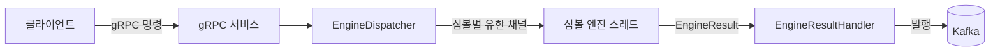

# Rust 매칭 엔진

## 1. 개요

Rust 기반의 심볼별 단일 스레드 매칭 엔진입니다.
gRPC로 주문 명령을 접수하고, 엔진 처리 결과는 Kafka 이벤트로 비동기 발행합니다.
거래소 전체 시스템을 구현하기보다 주문 처리 경로의 정합성, 역압, 지연 시간, 처리량을 검증하는 데 초점을 둡니다.
현재 실행 바이너리는 기본 심볼로 `BTCUSDT`를 등록하지만, 런타임 구조와 부하 테스트 도구는 다중 심볼 구성을 지원합니다.

## 2. 목표

- 심볼별 단일 스레드 엔진 구조 검증
- 가격-시간 우선 매칭 구현
- gRPC 기반 주문 접수와 경계 검증
- Kafka 기반 실행 결과 보고 발행
- 유한 채널 기반 역압 처리
- 런타임 부하 테스트와 통합 부하 테스트를 통한 처리량/지연 측정
- 오더북과 매칭 주요 경로에 대한 Criterion 벤치마크 관리

## 3. 비목표

- 계좌, 잔고, 증거금, 리스크 체크
- 영속 주문 저장소 또는 WAL 기반 복구
- 실제 거래소 수준의 장애 복구와 고가용성 클러스터링
- 분산 매칭 엔진 또는 심볼 리밸런싱
- 실거래소 연동
- 완전한 영속 멱등성 보장
- 주문 조회 API와 클라이언트 주문 id 관리

## 4. 아키텍처



- gRPC 서비스는 명령 접수, 요청 검증, `EngineCommand` 변환을 담당합니다.
- `EngineDispatcher`는 `symbol` 기준으로 명령을 해당 엔진 채널에 라우팅합니다.
- 각 심볼 엔진은 단일 스레드에서 자신의 오더북을 소유하고 명령을 순차 처리합니다.
- `EngineResultHandler`는 엔진 결과를 받아 Kafka 생산자로 전달합니다.
- gRPC ACK는 최종 체결 결과가 아니라 엔진 경계 접수 결과입니다. 최종 실행 결과는 Kafka 이벤트로 발행됩니다.

## 5. 주문 흐름

1. 클라이언트가 gRPC로 `PlaceOrderRequest`, `CancelOrderRequest`, `AmendOrderRequest` 중 하나를 전송합니다.
2. gRPC 서비스가 요청을 검증하고 `EngineCommand`로 변환합니다.
3. `EngineDispatcher`가 `symbol` 기준으로 명령을 라우팅합니다.
4. 심볼 엔진이 유한 채널에서 명령을 순차적으로 꺼내 처리합니다.
5. 엔진이 엔진별 순번을 포함한 `EngineResult`를 생성합니다.
6. `EngineResultHandler`가 결과를 Kafka에 발행합니다.
7. 하위 소비자는 Kafka 실행 결과 보고를 기준으로 최종 주문 상태를 갱신합니다.

## 6. 지원 기능

| 기능 | 상태 |
| --- | --- |
| 지정가 주문 | 지원 |
| 시장가 주문 | 지원 |
| 주문 취소 | 지원 |
| 주문 정정 | 지원 |
| GTC | 지정가 주문에서 지원 |
| IOC | 지원 |
| FOK | 사전 전량 체결 가능성 검사로 지원 |
| 기준 자산 수량 | 지원 |
| 견적 자산 수량 | 엔진 API 경계에서는 `MARKET BUY`만 지원 |
| 다중 심볼 런타임 | `EngineRuntime`에서 지원 |
| 기본 서버 심볼 설정 | `BTCUSDT`만 등록 |
| 단건 gRPC API | 지원 |
| 배치 gRPC API | `SubmitBatch`로 지원 |
| Kafka 이벤트 발행 | 지원 |
| 메모리 기반 오더북 | 지원 |
| 영속 복구 | 미지원 |

`LIMIT BUY + quote_qty`는 엔진 API에서 직접 받지 않습니다. 상위 주문 서비스가 `base_qty = quote_qty / price`로 변환해 엔진에 전달하는 계약입니다.

## 7. 매칭 규칙

- 가격-시간 우선 원칙을 사용합니다.
- 매수 주문은 가장 낮은 매도 호가부터 체결합니다.
- 매도 주문은 가장 높은 매수 호가부터 체결합니다.
- 같은 가격 레벨 안에서는 FIFO 순서로 체결합니다.
- 체결 가격은 메이커 주문의 가격을 사용합니다.
- 시장가 주문은 가격 조건 없이 반대편 호가를 소진하고 오더북에 잔존하지 않습니다.
- GTC 지정가 주문의 미체결 잔량은 오더북에 등록됩니다.
- IOC 주문의 미체결 잔량은 즉시 취소됩니다.
- FOK 주문은 매칭 전 전량 체결 가능 여부를 검사하고, 불가능하면 체결 없이 취소됩니다.
- 정정에서 가격이 유지되고 수량만 감소하면 기존 우선순위를 유지합니다.
- 정정에서 가격 변경 또는 수량 증가가 발생하면 기존 주문을 취소하고 새 주문으로 대체합니다.

## 8. 엔진 설계

핵심 오더북 구조는 가격 레벨과 주문 인덱스를 분리합니다.

```rust
OrderBook {
    bids: BTreeMap<Reverse<Decimal>, VecDeque<Uuid>>,
    asks: BTreeMap<Decimal, VecDeque<Uuid>>,
    index: HashMap<Uuid, Order>,
}
```

- `bids`는 높은 가격이 먼저 오도록 `Reverse<Decimal>`을 사용합니다.
- `asks`는 낮은 가격이 먼저 오도록 `Decimal` 오름차순을 사용합니다.
- 각 가격 레벨은 `VecDeque<Uuid>`로 FIFO를 유지합니다.
- 실제 주문 데이터는 `index`에 저장하고 가격 큐는 주문 id만 보관합니다.

각 심볼 엔진은 자신의 오더북을 소유하고 명령을 순차 처리합니다.
이 구조는 매칭 경로에서 잠금을 제거하고, 한 심볼 안에서 명령 실행 순서를 결정적으로 유지합니다.

현재 취소는 같은 가격 레벨 안에서 `retain`으로 주문 id를 제거하므로 레벨 크기에 대해 O(n)입니다.
이 비용은 벤치마크와 부하 테스트 문서에서 별도로 추적합니다.

## 9. gRPC API

핵심 RPC는 아래와 같습니다. 전체 proto는 `proto/engine.proto`를 기준으로 합니다.
ACK와 실행 결과 보고 계약은 `docs/engine_contract.md`에 따로 정리되어 있습니다.

```proto
service MatchingEngineService {
  rpc PlaceOrder(PlaceOrderRequest) returns (CommandAck);
  rpc CancelOrder(CancelOrderRequest) returns (CommandAck);
  rpc AmendOrder(AmendOrderRequest) returns (CommandAck);
  rpc SubmitBatch(SubmitBatchRequest) returns (SubmitBatchResponse);
}
```

`CommandAck`는 엔진 큐 접수 여부를 나타냅니다. `ACK_STATUS_ACCEPTED`여도 주문이 체결됐다는 뜻은 아닙니다.

| 상태 | 의미 | 재시도 가능 |
| --- | --- | --- |
| `ACK_STATUS_ACCEPTED` | 명령이 엔진 큐에 접수됨 | 아니오 |
| `ACK_STATUS_REJECTED` | 엔진 처리 전 경계에서 거부됨 | 아니오 |
| `ACK_STATUS_RESOURCE_EXHAUSTED` | 엔진 큐가 포화됨 | 예 |
| `ACK_STATUS_UNAVAILABLE` | 엔진이 중지됐거나 발행기가 비정상 상태임 | 예 |

주요 사유는 `ACK_REASON_ACCEPTED`, `ACK_REASON_INVALID_ARGUMENT`, `ACK_REASON_UNKNOWN_SYMBOL`, `ACK_REASON_ENGINE_CHANNEL_FULL`, `ACK_REASON_ENGINE_STOPPED`, `ACK_REASON_PUBLISHER_UNHEALTHY`입니다.

## 10. Kafka 이벤트

Kafka topic 기본값은 `matching-engine-events`입니다.
환경 변수 `MATCHING_ENGINE_KAFKA_TOPIC`으로 변경할 수 있고, Kafka key는 `symbol`입니다.

발행되는 최상위 이벤트 타입은 아래 세 가지입니다.

- `place`
- `cancel`
- `amend`

이벤트 봉투에는 공통 메타데이터가 포함됩니다.

| 필드 | 의미 |
| --- | --- |
| `event_id` | Kafka 이벤트 id |
| `schema_version` | 이벤트 스키마 버전, 현재 `1` |
| `emitted_at` | 생산자가 이벤트를 만든 시각 |
| `processed_at` | 엔진 처리 시각 |
| `command_id` | 클라이언트가 생성한 명령 id |
| `engine_sequence` | 심볼 엔진 sequence |
| `symbol` | 매칭 심볼 |
| `order_id` | 대표 주문 id |
| `event_type` | `place`, `cancel`, `amend` 중 하나 |

예시:

```json
{
  "event_id": "018f0000-0000-7000-8000-000000000001",
  "schema_version": 1,
  "emitted_at": "2026-06-14T00:00:00Z",
  "processed_at": "2026-06-14T00:00:00Z",
  "command_id": "018f0000-0000-7000-8000-000000000002",
  "engine_sequence": 42,
  "symbol": "BTCUSDT",
  "order_id": "018f0000-0000-7000-8000-000000000003",
  "event_type": "place",
  "data": {
    "taker_order_id": "018f0000-0000-7000-8000-000000000003",
    "outcome": { "type": "filled" },
    "trades": [
      {
        "trade_id": "018f0000-0000-7000-8000-000000000004",
        "taker_order_id": "018f0000-0000-7000-8000-000000000003",
        "maker_order_id": "018f0000-0000-7000-8000-000000000005",
        "price": "100",
        "base_qty": "1",
        "quote_qty": "100"
      }
    ],
    "updated_makers": []
  }
}
```

`TradeEvent`와 `OrderSnapshotEvent`는 `place`, `cancel`, `amend` 이벤트 내부에 중첩 payload로 포함됩니다.

## 11. 역압 전략

Dispatcher는 심볼 엔진마다 유한 채널을 사용합니다.
현재 엔진 명령 채널 용량은 심볼당 `1024`이고, 결과 채널 용량도 `1024`입니다.

채널이 가득 차면 gRPC 계층은 무기한 대기하지 않고 즉시 `ACK_STATUS_RESOURCE_EXHAUSTED`와 `ACK_REASON_ENGINE_CHANNEL_FULL`을 반환합니다.
Kafka 발행기가 실패해 결과 handler가 재시도 중이면 발행기 health를 비정상으로 표시하고, dispatcher는 새 명령에 `ACK_STATUS_UNAVAILABLE`을 반환합니다.

부하 테스트에서 함께 보는 핵심 지표는 아래와 같습니다.

- 초당 접수 성공 수
- 채널 포화 수
- 초당 완료 수 또는 Kafka 수신 수
- gRPC ACK p99
- ACK 이후 p99
- E2E p99
- 누락/중복 수

## 12. 성능 테스트

성능 측정은 두 경로로 나눕니다.

- `runtime_stress`: gRPC와 Kafka를 제외하고 `EngineRuntime` 내부 경로를 측정합니다.
- `integration_stress`: gRPC 인입부터 Kafka broker와 소비자 수신까지 E2E로 측정합니다.

상세 결과와 원본 로그는 `docs/stress/README.md`와 각 시나리오 문서에 기록합니다.

### 테스트 환경

| 항목 | 값 |
| --- | --- |
| 로컬 호스트 | MacBook Pro Mac16,8, Apple M4 Pro 12-core CPU, 메모리 24GB |
| 호스트 OS | macOS 26.3.1(a), build 25D771280a |
| Docker Desktop | Docker 27.3.1, Linux arm64/aarch64, cgroup v2, overlay2 |
| Docker VM 할당 | CPU 8개, 메모리 4,109,737,984 바이트 |
| SUT 리소스 제한 | CPU 1개, 메모리 1GB, swap 1GB |
| Kafka broker | Apache Kafka 4.1.2 |
| Kafka 리소스 제한 | CPU 2개, 메모리 2GB, swap 2GB |
| 부하 생성기 제한 | 명시적 제한 없음 |
| 심볼 수 | 1 |
| gRPC 연결 수 | 16 |
| 동시 실행 단위 | 512 |
| 전송 방식 | `SubmitBatch` |

### 최신 Integration 안전 구간 결과

| 시나리오 | 목표/s | 접수 성공/s | 채널 포화 | ACK p99 | E2E p99 | 무손실 |
| --- | ---: | ---: | ---: | ---: | ---: | --- |
| `full-fill-same-level` | 100,000 | 99,982.7 | 266 | 2.817ms | 22.910ms | 통과 |
| `market-quote-sweep` | 80,000 | 79,868.9 | 3,695 | 983us | 14.511ms | 통과 |
| `partial-fill-rest` | 100,000 | 99,986.8 | 270 | 918us | 21.174ms | 통과 |
| `place-resting-limit` | 25,000 | 24,986.3 | 340 | 2.095ms | 8.620ms | 통과 |
| `cancel-resting-order` | 100,000 | 99,985.9 | 0 | 997us | 10.217ms | 통과 |
| `amend-decrease-qty` | 50,000 | 49,994.9 | 0 | 1.785ms | 10.769ms | 통과 |
| `amend-price-change` | 75,000 | 74,991.3 | 0 | 1.400ms | 9.656ms | 통과 |

`채널 포화`는 gRPC `RESOURCE_EXHAUSTED` 역압 발생 수입니다.
거부된 명령은 Kafka 이벤트를 만들지 않으므로 무손실 판정은 접수 성공한 명령과 Kafka 이벤트의 1:1 상관으로 봅니다.

Criterion 마이크로 벤치마크는 `docs/bench/README.md`에서 관리합니다.

## 13. 실행 방법

### Docker Compose 실행

Kafka와 매칭 엔진을 실행합니다.

```bash
docker compose up -d kafka matching-engine
```

통합 부하 테스트 스모크:

```bash
docker compose run --rm integration-stress \
  --grpc-endpoint http://matching-engine:50051 \
  --kafka-brokers kafka:9092 \
  --orders 100 \
  --scenario place-resting-limit \
  --concurrency 16
```

런타임 부하 테스트 스모크:

```bash
docker compose run --rm runtime-stress \
  --duration-sec 1 \
  --target-commands-per-sec 100 \
  --sweep-depth 3 \
  --timeout-sec 5
```

### 로컬 개발

Kafka만 Docker로 띄우고 서버를 로컬에서 실행할 수 있습니다.

```bash
docker compose up -d kafka
cargo run --bin matching-engine
```

기본 Kafka 설정:

```bash
MATCHING_ENGINE_KAFKA_BROKERS=localhost:9092
MATCHING_ENGINE_KAFKA_TOPIC=matching-engine-events
```

테스트:

```bash
cargo test
```

벤치마크:

```bash
cargo bench --features bench-internals --bench matching-engine
cargo bench --features bench-internals --bench orderbook
```

## 14. 프로젝트 구조

```text
src/
  domain/              주문, 방향, 주문 타입, TIF, 도메인 오류
  engine/              Dispatcher, 런타임, 오더북, 매칭 로직, 결과 처리기
  grpc/                Tonic 서비스, 요청 변환기, ACK 매핑, 생성된 proto module
  kafka/               Kafka 생산자와 이벤트 DTO 매핑
  bin/
    integration_stress/ gRPC + Kafka E2E 부하 테스트 도구
    runtime_stress/     프로세스 내부 EngineRuntime 부하 테스트 도구
proto/                 gRPC 서비스와 메시지 계약
docs/
  bench/               Criterion 벤치마크 문서
  stress/              런타임/통합 부하 테스트 문서와 결과
benches/               Criterion 벤치마크 대상
tests/                 런타임 스모크 테스트
docker-compose.yml     Kafka, matching-engine, 부하 테스트 서비스 정의
Dockerfile             서버와 부하 테스트 도구 릴리스 이미지 정의
```

## 15. 설계 결정

### 심볼별 단일 스레드 모델

각 심볼은 전용 엔진 스레드를 가집니다.
이 구조는 심볼 단위 매칭을 결정적으로 유지하고, 명령 처리 중 오더북 잠금을 피합니다.

### 유한 채널

역압을 적용하기 위해 유한 채널을 사용합니다.
엔진이 유입량을 따라가지 못하면 무기한 대기하지 않고 `RESOURCE_EXHAUSTED`로 조기 거부합니다.

### gRPC ACK와 Kafka 실행 결과 보고 분리

명령 접수 결과는 gRPC로 동기 반환합니다.
실행 결과는 Kafka로 비동기 발행하므로, 하위 서비스는 Kafka 이벤트를 최종 주문 상태의 기준으로 삼아야 합니다.

### 메이커 가격 체결

체결은 메이커 가격으로 기록합니다.
이는 오더북의 가격-시간 우선 모델과 맞고, 지정가 주문이 여러 가격 레벨을 관통할 때 테이커 가격 해석의 모호성을 줄입니다.

### 취소 후 재등록 정정

가격 변경과 수량 증가는 취소 후 재등록을 통해 큐 우선순위를 잃습니다.
같은 가격에서 수량만 감소하는 경우에는 제자리 갱신으로 우선순위를 유지합니다.

## 16. 제한 사항

- 아직 영속 WAL이 없습니다.
- 엔진 장애 이후 복구를 지원하지 않습니다.
- 로컬 메모리 기반 오더북만 사용합니다.
- 현재 서버 bootstrap은 `BTCUSDT`만 등록합니다.
- 분산 심볼 리밸런싱을 지원하지 않습니다.
- 계좌, 잔고, 리스크 검증을 수행하지 않습니다.
- 완전한 영속 멱등성을 보장하지 않습니다.
- Kafka 발행 실패 시 무기한 재시도하고, 발행기 상태를 통해 새 dispatch를 차단합니다.
- 취소는 가격 레벨 안에서 O(n) 큐 스캔으로 주문을 제거합니다.
- 경계 검증 실패는 Kafka 실행 결과 보고를 만들지 않습니다.

## 17. 로드맵

- WAL 기반 복구 추가
- 하드코딩된 bootstrap에서 런타임 심볼 설정 분리
- 큐 위치 인덱싱으로 취소 복잡도 개선
- 접수, 거부, 채널 포화, 발행 재시도, 지연 시간에 대한 Prometheus 지표 추가
- 서비스 경계의 영속 멱등성/재실행 전략 추가
- 벤치마크 보고서 확장과 최적화 이력 비교
- Kafka 장애와 엔진 재시작 시나리오에 대한 운영 절차서 추가
